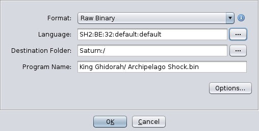
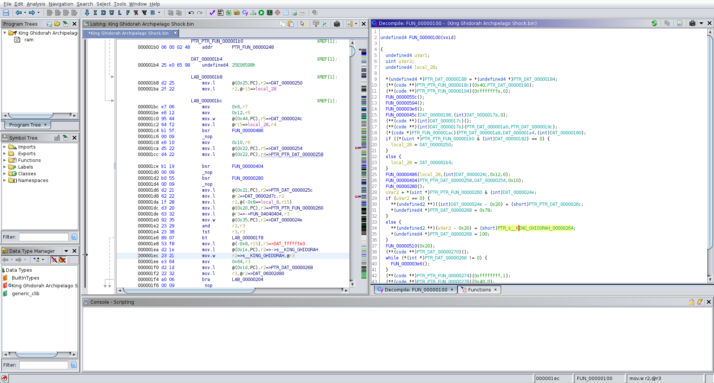

## Ghidra Sega Saturn Processor Module

A (WIP) processor module for Ghidra for Sega Saturn files. The Sega Saturn uses dual SuperH SH-2 processors for games. A dedicated SuperH SH-1 is used to control the CD-ROM drive.  

Currently:
- able to disassemble SH-2 after manually specifying processor type. I used the instruction encodings available from [Renesas SH Instruction Set Summary](http://shared-ptr.com/sh_insns.html) and related GitHub project [shared-ptr/sh_insns](https://github.com/shared-ptr/sh_insns). 
- contains SLEIGH definitions for ~99% of instructions. Currently debugging through issues related to sign extensions, flags, and branches. 
- able to decompile automatically. Output looks reasonable but likely to have issues due to errors in the SLEIGH definitions.

Todo: 
- fix remaining errors in SLEIGH definitions
- SH-1 support (99% the same as SH-2)
- create loader plugin (in a separate project)

## Screenshots

Loader screenshot  

Disassembly View (Decompiler somewhat working, still has some bugs)  

## Issues
I anticipate lots of bugs. It will take time to correct errors in the SLEIGH definition. 

## Installation
- Rename the root folder to SuperH and copy it to Ghidra/Processors/ and restart Ghidra

## Credits
- [shared-ptr/sh_insns](https://github.com/shared-ptr/sh_insns)
- [xyzz/ghidra-mep](https://github.com/xyzz/ghidra-mep)
- [Thog/ghidra_falcon](https://github.com/Thog/ghidra_falcon)

