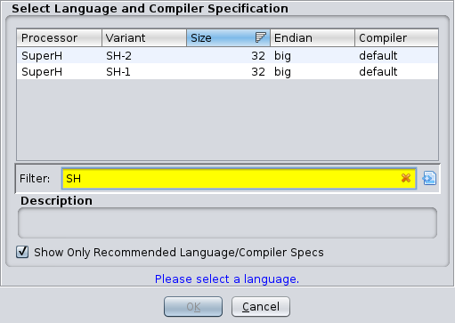

## Ghidra Sega Saturn Processor Module

A (WIP) Ghidra processor module for the Sega Saturn. The Sega Saturn uses dual SuperH SH-2 processors for games and a dedicated SuperH SH-1 to control the CD-ROM drive.  

Currently:
- able to disassemble SH-1 and SH-2 after manually specifying the processor type. I used the instruction encodings available from [Renesas SH Instruction Set Summary](http://shared-ptr.com/sh_insns.html) and related GitHub project [shared-ptr/sh_insns](https://github.com/shared-ptr/sh_insns). 
- contains SLEIGH definitions for all instructions. Currently debugging through issues related to sign extensions, flags, and branches. 
- able to decompile automatically. Output looks reasonable but likely to have issues due to errors in the SLEIGH definitions.

Todo: 
- fix remaining errors in SLEIGH definitions
- create loader plugin (in a separate project)

## Screenshots

Processors  

Loader  

Disassembly View (Decompiler working, still has some bugs)  

## Issues
I fixed a lot of the errors in the SLEIGH definitions but I anticipate there will be more bugs.

## Installation
- Rename the root folder to SuperH and copy it to Ghidra/Processors/ and restart Ghidra

## Credits
- [shared-ptr/sh_insns](https://github.com/shared-ptr/sh_insns) - instruction definitions
- [xyzz/ghidra-mep](https://github.com/xyzz/ghidra-mep) - example Ghidra processor module
- [Thog/ghidra_falcon](https://github.com/Thog/ghidra_falcon) - example Ghidra processor module
- [Yabause](https://github.com/Yabause/yabause) - Sega Saturn emulator I used to sanity check my disassembly 

